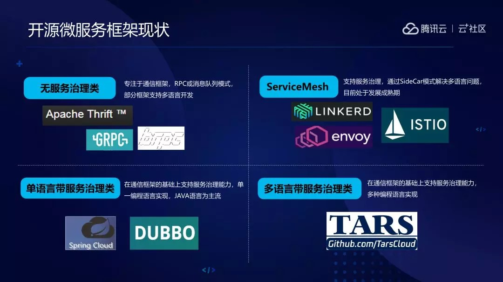

# tars-micro-service

目前开源界的微服务框架大体可以分为以下四个种类。

第一类是无服务治理的，这一类基本可以看做是一个RPC框架。RPC发展到现在已经有几十年的时间了，主要代表为gRPC、BRPC、Thrift，它们也都有对外开源的代码。

第二类是带治理功能，但是语言比较单一，主要的代表是以Java为主的Spring Cloud、dubbo等。

第三类就是Service Mesh，主要代表产品是Linkerd和ISTIO，这是未来的发展方向。

最后就是TARS，不仅支持多语言，还附带一些服务治理相关的功能产品。

https://tarscloud.org/   

##  官网

https://github.com/TarsCloud/Tars   

##  Docker搭建环境

